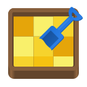
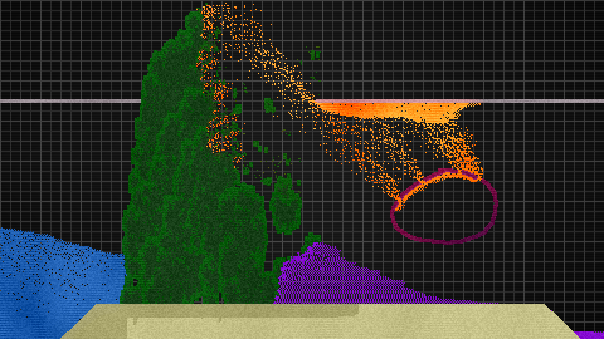

# Sandbox
### A sand simulation game

## Controls
### Basic Controls
* Click and drag the mouse to place particles
* <kbd>+</kbd> Increases brush size
* <kbd>-</kbd> Decreases brush size
* <kbd>Shift</kbd> Horizontal axis lock
* <kbd>Ctrl</kbd> Vertical axis lock
* Axis lock - When held, it creates a straight line between where you first started holding it, and the current mouse location
    * Not enabled for Electricity or Fire
### Particle Types
* <kbd>D</kbd> Eraser tool
* <kbd>S</kbd> Sand
* <kbd>W</kbd> Water
* <kbd>A</kbd> Acid
* <kbd>I</kbd> Iridium
* <kbd>R</kbd> Replicator
* <kbd>P</kbd> Plant
* <kbd>C</kbd> Cryotheum
* <kbd>U</kbd> Unstable
* <kbd>E</kbd> Electricity
* <kbd>L</kbd> Life
* <kbd>F</kbd> Fire
* <kbd>M</kbd> Mirror
* There are some particles that can't be directly placed, and aren't listed here. Play around, and figure out how to create them!
### Misc
* <kbd>Esc</kbd> Quits the game
* <kbd>Enter</kbd> Toggles fullscreen
* <kbd>Backspace</kbd> Clears the sandbox
* <kbd>Space</kbd> Toggles pause
* <kbd>.</kbd> Advances one frame when paused
* <kbd>1</kbd> Starts/stops recording a video

## Video Recording
Sandbox has the ability to record a video of the screen as you play.

Videos will be saved to the following folders:

| Platform | Folder              | Example               |
| -------- | ------------------- | --------------------- |
| Linux    | `XDG_VIDEOS_DIR`    | /home/alice/Videos    |
| Windows  | `FOLDERID_Videos`   | C:\Users\Alice\Videos |
| macOS    | `$HOME/Movies`      | /Users/Alice/Movies   |

---

Video recording is not enabled by default, and can be enabled by passing `--features video-recording` to cargo when compiling.

You must also have the following non-rust dependencies installed on your system:
* GStreamer
* GStreamer Base Plugins
* GStreamer Good Plugins
* GStreamer Ugly Plugins
