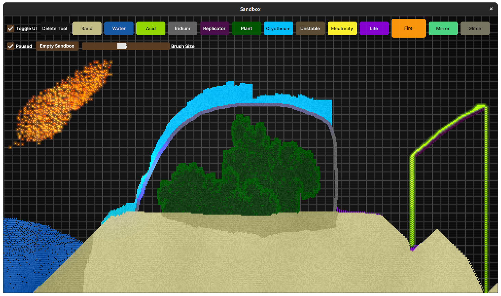

# Sandbox
### A sand simulation game

## Controls
### Basic Controls
* Click and drag the mouse to place particles
* <kbd>+</kbd> Increases brush size
* <kbd>-</kbd> Decreases brush size
* <kbd>Shift</kbd> Horizontal axis lock
* <kbd>Ctrl</kbd> Vertical axis lock
    * Axis lock - When held, it creates a straight line between where you first started holding it, and the current mouse location (Not enabled for Electricity)
### Particle Type Selection
* <kbd>D</kbd> Delete tool
* <kbd>S</kbd> Sand
* <kbd>W</kbd> Water
* <kbd>A</kbd> Acid
* <kbd>I</kbd> Iridium
* <kbd>R</kbd> Replicator
* <kbd>P</kbd> Plant
* <kbd>C</kbd> Cryotheum
* <kbd>U</kbd> Unstable
* <kbd>E</kbd> Electricity
* <kbd>L</kbd> Life
* <kbd>F</kbd> Fire
* <kbd>M</kbd> Mirror
* <kbd>G</kbd> Glitch
* There are some particles that can't be directly placed, and aren't listed here. Play around, and figure out how to create them!
### Misc
* <kbd>Space</kbd> Toggles pause
* <kbd>Enter</kbd> Toggles fullscreen
* <kbd>Esc</kbd> Quits the game
* <kbd>Backspace</kbd> Empty the sandbox
* <kbd>1</kbd> Toggle UI on/off
* <kbd>2</kbd> Toggle FPS display on/off
* <kbd>3</kbd> Toggle profiling display on/off
* <kbd>.</kbd> Advances one frame when paused
